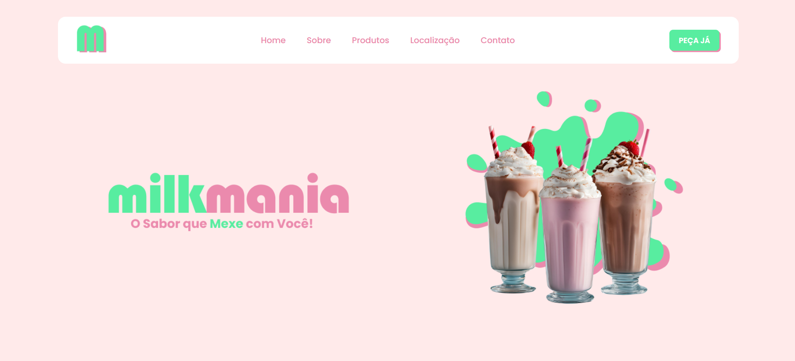

# Milkmania - Landing Page 🥤

  

### Sobre o Projeto 🍦✨
Esta é uma landing page fictícia desenvolvida para a Milkmania, uma marca fictícia especializada em milkshakes. O design e a identidade visual foram criados por mim para apresentar a marca de maneira atraente.

### Tecnologias Utilizadas 🛠️
-  **HTML**: Estrutura da página.
-  **CSS**: Estilo e layout, proporcionando um design atraente.
-  **JavaScript**: Funcionalidades interativas para melhorar a experiência do usuário.
-  **Figma**: Ferramenta utilizada para o design e identidade visual da página.

 

> ❗ **Nota:** Esta página é meramente ilustrativa e não possui funcionalidades de e-commerce. O formulário de contato também não é funcional e serve apenas para fins de demonstração.

### Explore e Visite! 🚀
Para ver a landing page em ação, visite o [link da página](https://milkmania.vercel.app).

